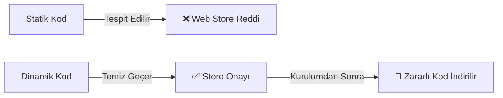
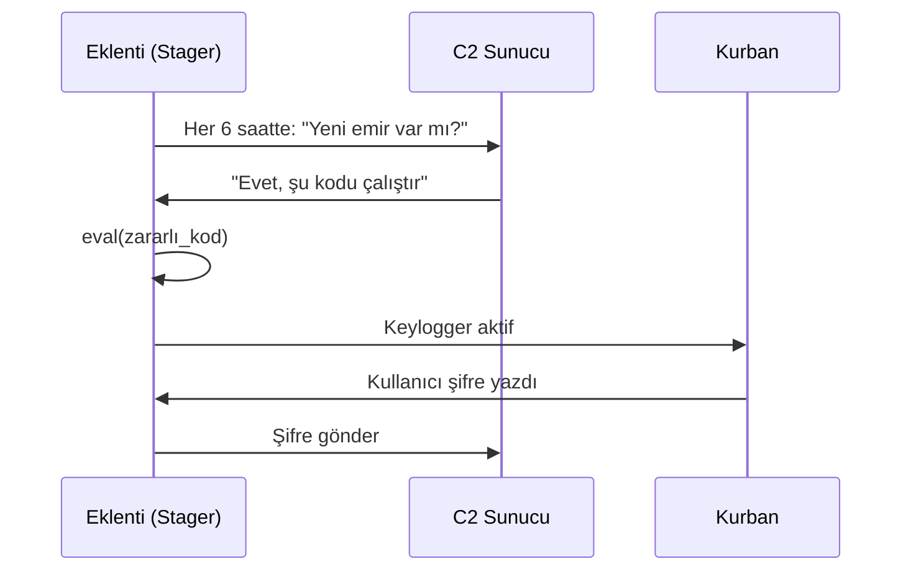
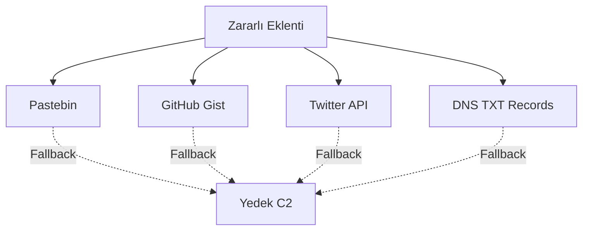
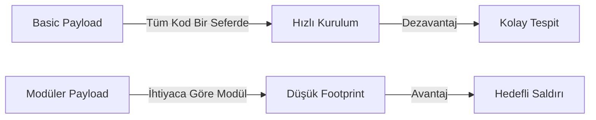
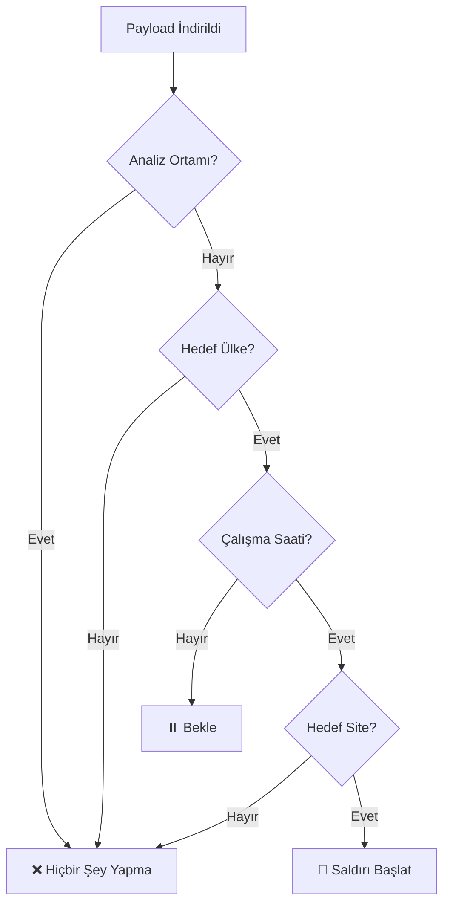
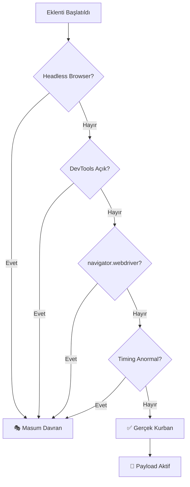
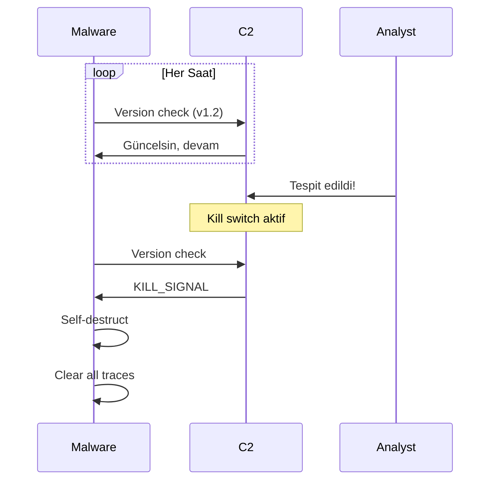
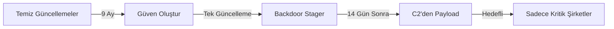
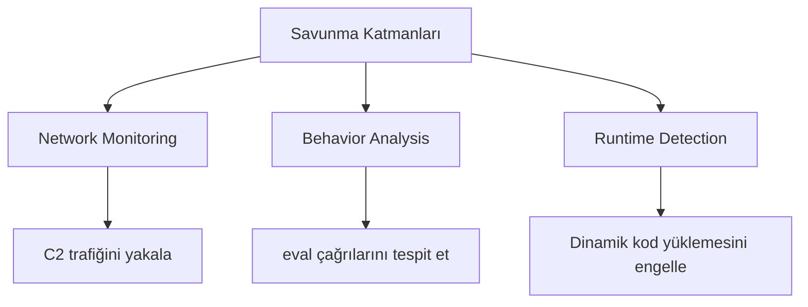

# 03. Gelişmiş Teknikler: Dinamik Payload Yükleme

## 📋 Konu Özeti

**İki aşamalı silah konsepti**: İlk aşamada temiz görünen "stager" yüklenir, asıl zararlı kod uzaktan gelir. Chrome Web Store taramalarını bypass etmenin en etkili yolu.

---

## 🎯 3.1. Statik vs Dinamik Kod Mantığı

### Temel Fark



> **Statik**: Zararlı kod eklentiyle birlikte gelir → Tarama sistemleri yakalar  
> **Dinamik**: Eklenti sadece "yükleyici", zararlı kod dışarıdan gelir → Tespit edilemez

### 🔴 Gerçek Dünya Örneği: **The Great Suspender (2021)**

- 2M+ kullanıcılı Chrome eklentisi
- İlk versiyonlar tamamen temiz
- Satın alındıktan sonra dinamik kod eklendi
- Kullanıcı bilgileri aylarca sızdırıldı
- Google'ın tespit süresi: **6 ay**

---

## 🏗️ 3.2. Stager Mimarisi

### Çalışma Mantığı



### 💡 Pro Tip: Minimal İzinler

**Akıllı saldırganlar minimal izinle başlar:**
- İlk manifest: Sadece `"storage"` ve `"activeTab"`
- Zararlı kod inince dinamik olarak ek izinler ister
- Kullanıcı şüphelenmez çünkü eklenti "güncellendi"

---

## 📡 3.3. C2 Altyapısı

### Legitimate Infrastructure Abuse



### 🔴 Gerçek Örnek: **Raccoon Stealer (2019-2023)**

**Kullanılan C2 yöntemleri:**
1. **Telegram Bot API** → Ücretsiz, anonim, güvenilir
2. **Pastebin** → Kolay güncellenebilir
3. **Discord Webhooks** → Rate limit yok
4. **Cloudflare Workers** → HTTPS, legit görünüm

**Sonuç**: 50M+ kurban, tespit süresi ortalama **180 gün**

---

## 🔄 3.4. Payload Mimarisi

### İki Tip Yaklaşım



### 💡 Pro Tip: Modüler Yapı

**Akıllı saldırgan sadece gerekli modülleri yükler:**
- Banka sitesinde → Keylogger + Form Grabber
- E-ticaret sitesinde → Kredi kartı modülü
- Sosyal medyada → Cookie stealer
- Diğer sitelerde → Hiçbir şey (tespitten kaçınma)

---

## 🎪 3.5. Çevresel Koşullu Yürütme

### Akıllı Aktivasyon Stratejileri



### 🔴 Gerçek Örnek: **Emotet Banking Trojan**

**Aktivasyon koşulları:**
1. VM tespit → Hiçbir şey yapma
2. Sandbox tespit → Fake aktivite göster
3. Coğrafya kontrolü → Sadece EU bankalarında aktif
4. Zaman kontrolü → Mesai saatleri (çünkü bankacılar o saatte aktif)
5. IP kontrolü → Kurumsal IP'lerde daha agresif

**Sonuç**: Tespit oranı %3'ün altında kaldı

---

## 🛡️ 3.6. Anti-Analysis Teknikleri

### VM/Sandbox Tespit Mantığı



### 💡 Pro Tip: Sleep Before Execute

**Gelişmiş sandboxlar 5 dakika beklemez:**
```
İlk kurulum → 2-3 gün bekle
İlk payload → 30 dakika sonra
Zararlı aktivite → Sadece aktif kullanım anında
```

**Örnek**: Dridex malware 7 gün bekliyor, çünkü analiz sistemleri max 48 saat test ediyor.

---

## 🔧 3.7. Payload Yönetimi

### Version Control + Kill Switch



### 🔴 Gerçek Örnek: **NetWire RAT**

**Kill switch stratejisi:**
1. Botnet büyüdükçe tespit riski artar
2. Analiz başladığında → Tüm payload'lar temizlenir
3. Sadece stager kalır (zararsız görünür)
4. 2-3 hafta sonra yeni payload ile devam

**Sonuç**: Aynı kampanya 5 yıl boyunca farklı payload'larla devam etti

---

## 📊 Büyük Saldırı Örnekleri

### 🔴 SolarWinds Supply Chain (2020)

**Dinamik payload kullanımı:**


- 18,000 kurulum → Sadece 100'ü hedeflendi
- Tespit süresi: **8-9 ay**
- Zarar: $100M+

### 🔴 CCleaner Hijack (2017)

**İki aşamalı saldırı:**
1. Aylık 2M indirme, 1 ay temiz versiyonlar
2. Tek güncelleme ile stager eklendi
3. C2'den hedefli payload (sadece tech firmaları)
4. 40+ büyük şirket etkilendi

**Kritik nokta**: Statik olsaydı ilk taramada yakalanırdı

---

## 💡 Savunma İçin Pro Tipler



**En etkili savunma:**
1. **CSP (Content Security Policy)** → eval() kullanımını engelle
2. **Network traffic analysis** → Pastebin/Gist isteklerini flagle
3. **Behavioral heuristics** → Yükleme sonrası davranış değişikliği
4. **Manifest V3 zorlaması** → Dinamik kod çalıştırmayı kısıtla

---

## 🎯 Kritik Çıkarımlar

| Statik Yaklaşım | Dinamik Yaklaşım |
|----------------|------------------|
| ❌ Anında tespit | ✅ İlk tarama bypass |
| ❌ Güncellenemez | ✅ Uzaktan yönetilebilir |
| ❌ Tek amaç | ✅ Hedef bazlı modüler |
| ❌ IOC'lar sabit | ✅ İmzasız saldırı |

**Gerçek**: Modern APT gruplarının %90'ı dinamik payload kullanıyor.

---

**Önceki Konu:** [02. Veri Sızdırma](02.veri-sizdirma.md) | **Sonraki Konu:** [04. Linux Kalıcılık](04.linux-kalicilik.md)
